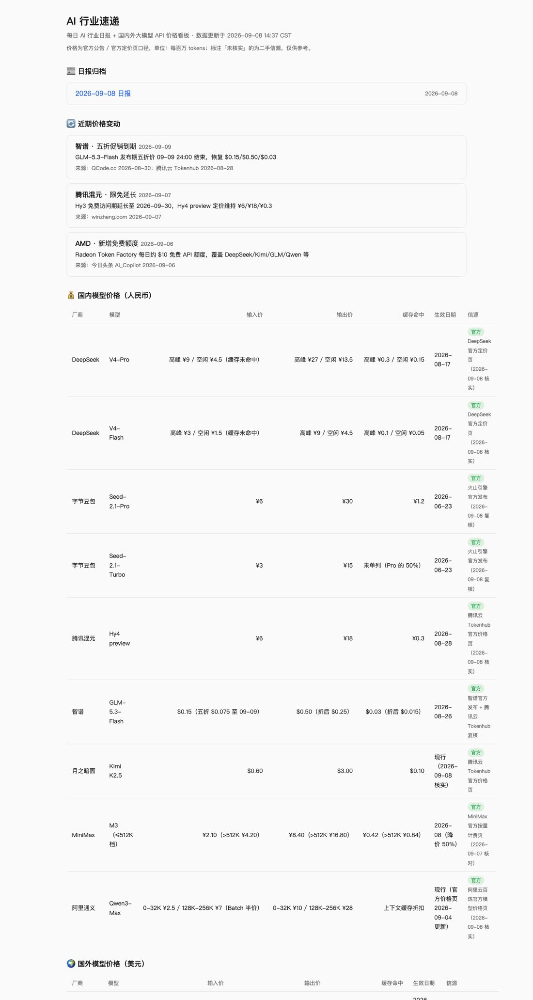

<div align="center">


# AI 行业速递

**每日 AI 行业中文日报 + 国内外大模型 API 价格看板**

[](https://yuling170916.github.io/AI-Industry-Express/)
[](./LICENSE)
[](https://github.com/yuling170916/AI-Industry-Express/actions)

每天早上 **8:00（北京时间）** 自动抓取官方定价页、重建页面。打开即用，无需部署。

</div>

---

## 📸 看板长这样



**在线地址 → https://yuling170916.github.io/AI-Industry-Express/** （手机 / 电脑浏览器均可打开，每天刷新即可）

## ✨ 功能

- 💰 **价格对比**：国内（DeepSeek / 豆包 / 混元 / 智谱 / Kimi / MiniMax / 通义）与国外（OpenAI / Anthropic / Google）主流模型 API 的输入价、输出价、缓存命中价
- 🔄 **近期变动**：降价 / 涨价 / 限免 / 新计费档，逐条标注幅度与来源
- 📰 **日报归档**：按日期存放的 AI 行业日报（Markdown）
- 🔖 **信源分级**：`官方` = 官方公告/定价页口径；`未核实` = 二手信源，明确标注不混同

## 🚀 快速开始（fork 后 3 分钟拥有自己的看板）

```bash
# 1. Fork 本仓库到你的账号

# 2. 在你的 fork 上：Settings → Pages → Source 选择 gh-pages 分支 / (root)
#    （首次 Actions 运行后自动创建 gh-pages 分支，也可先手动触发一次 workflow）

# 3. 访问 https://<你的用户名>.github.io/<你的仓库名>/
```

个性化：

- **改价格数据**：直接编辑 [`AI行业速递/data/prices.json`](./AI行业速递/data/prices.json)，推送后 Actions 自动重建页面
- **写日报**：把 [`AI行业速递/prompts/daily-report.md`](./AI行业速递/prompts/daily-report.md) 的提示词丢给任意 AI 助手（Kimi / ChatGPT / Claude…），产出存进 `AI行业速递/reports/` 即自动出现在站点归档
- **换跟踪的厂商**：改 `scripts/fetch_prices.py` 里的 `SOURCES` 清单

## 🗂️ 目录结构

```
├── AI行业速递/
│   ├── data/prices.json        # 价格数据（信源分级：官方 / 未核实）
│   ├── prompts/daily-report.md # 日报生成提示词
│   ├── reports/                # 日报归档（YYYY-MM-DD.md）
│   └── scripts/
│       ├── fetch_prices.py     # 抓取官方定价页状态（零依赖，Python 3.9+）
│       └── build_site.py       # 渲染静态站点到 dist/（零依赖）
├── .github/workflows/daily.yml # 每天北京时间 8:00 自动构建 + 发布 Pages
└── docs/images/                # README 配图
```

## 🏗️ 工作原理

```
GitHub Actions（每天 8:00 CST 触发）
   │
   ├─ fetch_prices.py ──► 抓取 9 家官方定价页，刷新可达性状态 ──► data/prices.json
   │
   ├─ build_site.py   ──► 价格表 + 变动 + 日报归档 ──► dist/index.html
   │
   ├─ 回写 prices.json 到 main 分支（[skip ci]）
   │
   └─ peaceiris/actions-gh-pages ──► 发布到 gh-pages ──► GitHub Pages 🌐
```

设计原则：

- **零第三方依赖**：脚本只用 Python 标准库，Actions 环境开箱即用
- **优雅降级**：任一官方页面抓取失败不影响整体，状态记录在 `prices.json` 的 `sources` 字段
- **诚实标注**：自动抽取对 JS 渲染页面能力有限，核心价格以人工/AI 校准的官方口径为准，`未核实` 数据永不冒充官方

## 📮 日报工作流（搭配任意 AI 助手）

```
┌────────────┐   prompts/daily-report.md   ┌──────────┐
│  你的 AI 助手 │ ───────────────────────► │ 当日日报  │
└────────────┘   （联网检索 + 官方信源核对）  └────┬─────┘
                                                │ 存入 reports/
                                                ▼
                                    次日 8:00 自动上线站点归档
```

## 📄 许可

[MIT](./LICENSE) — 欢迎 fork、改造、二次分发。
